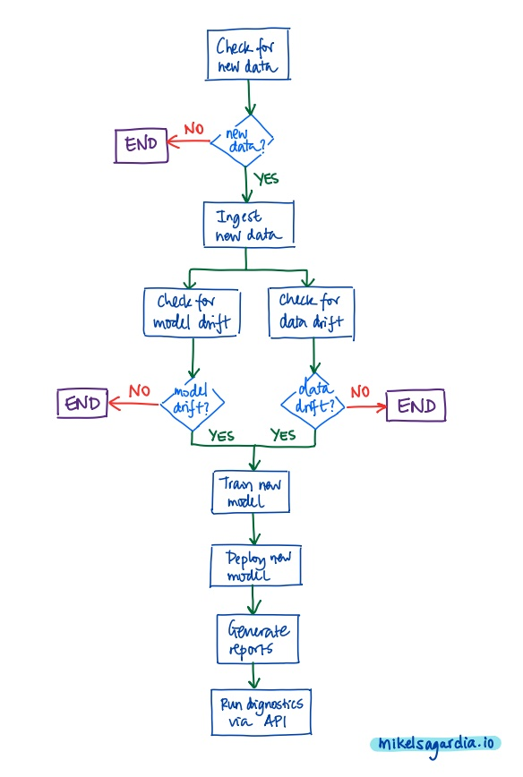

# A Dynamic Risk Assessment System: Monitoring of a Customer Churn Model

This project contains a dynamic risk assessment system in which a customer churn model is monitored after a simulated deployment.

*Customer churn* refers to the clients that have a high probability of halting the use of the services provided by a company, a.k.a. attrition risk. This is a common business problem faced by all companies; a related key principle behind it is that it's easier to keep a customer than getting a new one. Thus, the goal is to predict churn and a to avoid it.

I took the [starter code](https://video.udacity-data.com/topher/2021/March/60412fe6_starter-file/starter-file.zip) for this project from the [Udacity Machine Learning DevOps Engineer Nanodegree](https://www.udacity.com/course/machine-learning-dev-ops-engineer-nanodegree--nd0821) and modified it to the present form, which deviates significantly from the original version.

The focus of this project doesn't lie so much on the data processing or modeling, but on the techniques and technologies used for model/pipeline **monitoring after deployment**; in fact, dummy datasets are used instead of realistic ones. Monitoring is achieved by implementing methods that enable these functionalities:

- [x] **Data ingestion**: new data can be checked ad-hoc.
- [x] **Re-training, Re-scoring and Re-deploying**: with new data, data and model drift can be computed; if there is drift, the monitoring system is able to re-train and re-deploy a model/pipeline.
- [x] **Online diagnostics via an API**: any deployed model/pipeline can be diagnosed by stakeholders using a REST API.
- [x] **Status reporting**: beyond API diagnoses, complete model status reports can be generated.
- [x] **Process automation with cron jobs**: the complete monitoring process can be automated, from data check to re-deployment and reporting; additionally, the execution can run with the desired frequency.

## Table of Contents

- [A Dynamic Risk Assessment System: Monitoring of a Customer Churn Model](#a-dynamic-risk-assessment-system-monitoring-of-a-customer-churn-model)
  - [Table of Contents](#table-of-contents)
  - [Dataset](#dataset)
  - [How to Use This Project](#how-to-use-this-project)
    - [Installing Dependencies for Custom Environments](#installing-dependencies-for-custom-environments)
  - [Monitoring Implementation](#monitoring-implementation)
    - [1. Data Ingestion](#1-data-ingestion)
    - [2. Training, Scoring, Deploying](#2-training-scoring-deploying)
    - [3. Diagnostics](#3-diagnostics)
    - [4. Reporting](#4-reporting)
    - [5. Process Automation](#5-process-automation)
  - [Results and Conclusions](#results-and-conclusions)
  - [Next Steps, Improvements](#next-steps-improvements)
  - [References and Links](#references-and-links)
  - [Authorship](#authorship)


## Dataset

The dataset is composed of 5 CSV files, with 5 columns each, distributed as follows:

```
data
├── ingested/           # Ingested data folder (populated when run)
│   └── ...
├── development         # Data used during development
│   ├── dataset1.csv    # Shape: (17, 5)
│   └── dataset2.csv    # Shape: (19, 5)
├── production          # Production data, for re-training
│   ├── dataset3.csv    # Shape: (11, 5)
│   └── dataset4.csv    # Shape: (15, 5)
└── test                # Data for model testing
    └── test_data.csv   # Shape: (5, 5)
```

The files contain fabricated information of hypothetical corporations and, as shown, they consist of less than 20 entries/rows each. The 5 common columns are the following:

- `corporation`: fictional name of the customer company (hashed name)
- `lastmonth_activity`: number of services/goods provided last month
- `lastyear_activity`: number of services/goods provided last year
- `number_of_employees`: number of employees at the customer company
- `exited`: **target**, whether the customer company ceased to buy services/goods.

In summary, the dataset consists of 3 useful numerical features and a binary classification is done, which predicts customer company churn.

## How to Use This Project

The directory of the project consists of the following files:

```
.
├── Instructions.md         # Summary of instructions by Udacity
├── README.md               # This file
├── api_calls.py            # Calls to the API
├── app.py                  # API endpoints
├── assets/                 # Images and additional files
│   └── ...
├── config.json             # Configuration parameters for scripts
├── cronjob.txt             # Cron job
├── data/                   # Dataset(s), dev and prod
│   └── ...
├── deployment.py           # It deploys a trained model
├── diagnostics.py          # Model and data diagnostics
├── full_process.py         # It checks whether re-deploy needed
├── ingestion.py            # It ingests new data
├── models/                 # Training artifacts (dev and prod)
│   └── ...
├── reporting.py            # Reports about model metrics
├── requirements.txt        # Deployment dependencies
├── scoring.py              # Model scoring
├── training.py             # Model training, artifacts generated
└── wsgi.py                 # API deployment
```

Once we have created an environment and [installed the required dependencies](#installing-dependencies-for-custom-environments), we can run the scripts separately as follows:

```bash
# Ingest data
python ingestion.py
# Train model/pipeline
python training.py
# Deploy model/pipeline
python deployment.py
# Score model/pipeline
python scoring.py
# Report
python reporting.py
# Run diagnosis
python diagnosis.py
```

Alternatively, we can run the full process as follows:

```bash
python full_process.py
```

If we want to start the diagnosing API, we need to run:

```bash
# Shell 1: Start the API on the web server: http://localhost:8000
python app.py
# Shell 2: API access calls
python api_calls.py
```

The section [Monitoring Implementation](#monitoring-implementation) explains in more detail what happens in each of the steps/scripts.

### Installing Dependencies for Custom Environments

If you'd like to control where the notebook runs, you need to create a custom environment and install the required dependencies. A quick recipe which sets everything up with [conda](https://docs.conda.io/en/latest/) is the following:

```bash
# Create an environment
conda create --name churn pip
conda activate churn

# Install pip dependencies
pip install -r requirements.txt
```

## Monitoring Implementation

As mentioned in the introduction, this mini-project focuses on **monitoring techniques**. Monitoring is essential in production after having deployed a machine learning model, because it helps address inevitable issues that will appear in our system, such as:

- Data drift: sooner or later, the distribution of data features that arrive to the model will change as compared to the original training dataset; we need to detect that to re-train and re-deploy the inference pipeline.
- Data integrity: some features might be missing or corrupt; we should detect and process them.
- Model accuracy might decrease with time, e.g., because the business context changes (more customers leave than usual because of the global economic situation); we should detect that to re-train the model.
- New component versions might destabilize the system; we should detect and fix those dependency inconsistencies.
- etc.

To fix all those issues, monitoring is applied in 5 aspects:

1. Data Ingestion
2. Training, Scoring, Deploying
3. Diagnostics
4. Reporting
5. Process Automation

Note that the file paths in the following subsections are denoted for the **`development`** stage; in a **`production`** stage:

- The data is ingested from `data/source`.
- The training, scoring and diagnosing artifacts are output to `models/production`.

The distinction between `development` and `production` can be controlled by manually updating `config.json` as follows:

- In `development`: 

  ```json
  "input_folder_path": "data/development"
  "output_model_path": "models/development"
  ```

- In `production`: 

  ```json
  "input_folder_path": "data/production"
  "output_model_path": "models/production"
  ```

Additionally, in a real production environment, the `flask_secret_key` field from `config.json` should be removed from the file/repository. Instead, we should use either (*i*) secrets, (*ii*) environment variables, or (*iii*) the production `config.json` should not be committed.

### 1. Data Ingestion

The script [`ingestion.py`](./ingestion.py) is responsible for merging data from different sources. Additionally, a record of source information is stored in order to backtrace the origin of the values.

As the rest of the scripts, [`ingestion.py`](./ingestion.py) relies on [`config.json`](./config.json), which defines all the parameters (i.e., filenames, paths/URLs, etc.).

Produced outputs:

- `data/ingested/final_data.csv`: merged dataset.
- `data/ingested/ingested_files.csv`: dataset origin info related to the merge (path, entries, timestamp).

### 2. Training, Scoring, Deploying

After loading all the necessary parameters from [`config.json`](./config.json), the following three files train the inference pipeline (model), evaluate its performance (i.e., score it on a test dataset) and deploy it to the production location (sub-tasks listed):

- [`training.py`](./training.py):
  - Read merged dataset: `data/ingested/final_data.csv`
  - Define and train a logistic regression model
  - Save the model pickle: `models/development/trained_model.pkl`
- [`scoring.py`](./scoring.py):
  - Load the saved model pickle: `models/development/trained_model.pkl`
  - Load the test dataset: `data/test/test_data.csv`
  - Compute the F1 score of the model on the test dataset
  - Persist score records to file: `models/development/latest_score.csv`
- [`deployment.py`](./deployment.py):
  - Copy the following files from the development/practice folders to the deployment folder `deployment`:
    - The trained model: `models/development/trained_model.pkl`
    - The records of the ingested data files used for training: `data/ingested/ingested_files.csv`
    - The records of the model scores: `models/development/latest_score.csv`

### 3. Diagnostics

The script [`diagnostics.py`](./diagnostics.py) is responsible tracking dataset properties (to prevent data drift) and model predictions (to prevent model drift). Additionally, it measures operational aspects (timings, dependencies) to prevent anomalies. All in all it:

- Performs model predictions with a test dataset: `data/test/test_data.csv`.
- Provides with statistics of the training dataset, i.e., column means, medians, std. devs., NAs (count and percentage).
- Computes the timing for for the `ingestion.py` and `training.py` scripts.
- Provides information on dependencies: expected versions vs. actual per package; the `requirements.txt` file is used.

### 4. Reporting

Reporting is a accomplished with three scripts:

- [`reporting.py`](./reporting.py)
- [`app.py`](./app.py)
- [`api_calls.py`](./api_calls.py)

The file [`reporting.py`](./reporting.py) uses the `model_prediction()` function from `diagnostics.py` to predict the classes from `data/test/test_data.csv` and generate a confusion matrix, which is saved to `models/development/confusion_matrix.png`.

If we run the file [`app.py`](./app.py), 

```bash
python app.py
```

it creates and serves an API based on Flask with the following endpoints, which can be used from another terminal session or with the browser:

```bash
# Predict in batch given a path to a dataset, e.g., data/test/test_data.csv
curl "http://localhost:8000/prediction?filename=data/test/test_data.csv"

# Predict in batch given a path to a dataset and compute F1 score; 
# if no filename passed, data/test/test_data.csv is used.
curl "http://localhost:8000/scoring"

# Given a dataset, compute its summary stats, i.e.,
# for each column/feature: mean, median, std. dev., NAs;
# if no filename passed, data/ingested/final_data.csv is used.
# Note: HTML table is returned.
curl "http://localhost:8000/summarystats"

# Check the time necessary for ingestion and training.
curl "http://localhost:8000/diagnostics/timing"

# Check the dependencies.
# Note: HTML table is returned.
curl "http://localhost:8000/diagnostics/dependencies"

# Redirect to '/diagnostics/timing'.
curl "http://localhost:8000/diagnostics"
```

In [`app.py`](./app.py), the functions from `diagnostics.py` are used to compute the responses.

Finally, the file [`api_calls.py`](./api_calls.py) uses all those API endpoints and writes their responses to the file `models/development/api_returns.txt`.

As always, any necessary parameters (i.e., paths, filenames, etc.) are taken from `config.json`.

### 5. Process Automation

It is possible to run all scripts mentioned so far in sequence, as done by [`full_process.txt`](./full_process.txt); the following image shows the complete monitoring workflow implemented in that file:

<p style="text-align:center">
  
</p>

As we can see, [`full_process.txt`](./full_process.txt) performs these actions:

- Check if there is new data; if so, ingest it and continue
- Check if there is model or data drift; if so:
  - Re-train
  - Re-deploy
  - Run reporting for the re-deployed model 
  - Compute new score for the re-deployed model
  - Run diagnostics for the re-deployed model

We can launch the app with API in the same execution, but that means we need to kill any previously running API. The monitoring process can be further automated by creating a cron job which executes [`full_process.txt`](./full_process.txt) every 10 minutes, as defined in [`cronjob.txt`](./cronjob.txt). To create a cron job on a Unix machine, we can follow this recipe:

```bash
# Start the cron service, if not done already
service cron start
# Edit the crontab with the job
# * * * * 10  python /home/mikel/git_repositories/churn_model_monitoring/full_process.py
crontab -e
# ESC, i, edit, :q
# Load the crontab and display jobs
crontab -l
```

## Results and Conclusions

## Next Steps, Improvements

- [ ] Generate PDF reports which aggregate all outcomes (plots, summary statistics, etc.); check: [reportlab](https://www.reportlab.com/).
- [ ] Store time trends: timestamp the reported results and store them (e.g., NAs, latency, etc.).
- [ ] Store datasets and records in SQL databases, e.g., with [MySQL Connector/Python](https://dev.mysql.com/doc/connector-python/en/).

## References and Links

- A
- B
- C
- Link
- Link

## Authorship

Mikel Sagardia, 2022.  
No guarantees.

If you find this repository useful, you're free to use it, but please link back to the original source.
